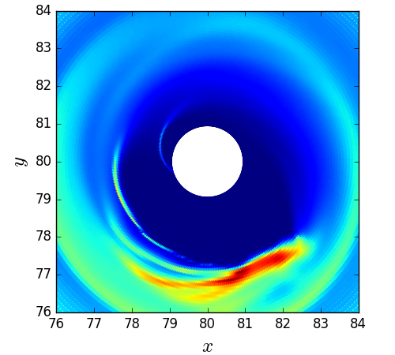
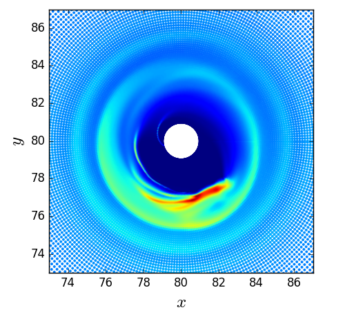

disk_data_analysis - Analysis and Plotting Tools for HDF5 simulation data of meshless/moving-mesh hydrodynamical disks 
==================================================
.. sectnum::

.. class:: no-web
           
   .. image:: example_figures/disk_images.png
      :height: 100px
      :width: 400 px

Overview
--------

A Python package!

Installation
--------

You need to have git installed. In addition, you need the NumPy and SciPy Python packages.

.. code::
   
   git clone https://github.com/djmunoz/disk_data_analysis.git

   cd disk_data_analysis
   
   sudo python setup.py install

That is all!

Examples
--------

Reading-in and plotting data
~~~~~~~

First of all, load the package and check the functions/attributes in it:

.. code:: python
	  
   import disk_data_analysis.circumbinary as dda

   dir(dda)
   
The most basic function in that list is :code:`get_snapshot_data`,
which can be used to give

.. code:: python
	  
   snap = dda.get_snapshot_data('./data/snap_',0,['POS','VEL'])

which will only contain the requested quantities :code:`POS` (positions)
and :code:`VEL` (velocities). You can double-check the attributes of
the  :code:`snap` data structure by doing

.. code:: python
	  
   dir(snap.gas)

   
You can see the distribution of particles/mesh generating points by plotting
the positions

.. code:: python

   import matplotlib.pyplot as plt

   x = snap.gas.POS[:,0]
   y = snap.gas.POS[:,1]
   box = snap.header.boxsize
   plt.plot(x,y,'b.',ms=2.4)
   plt.xlim(0.5 * box - 2.5, 0.5 * box + 2.5)
   plt.ylim(0.5 * box - 2.5, 0.5 * box + 2.5)
   plt.xlabel(r'$x$',size=18)
   plt.ylabel(r'$y$',size=18)
   plt.show()
   
.. image:: example_figures/figure_points.png
   :align: right
   :scale: 50
   :height: 40px
   :width: 40 px
   
Computing radial profiles
~~~~~~~

Mapping onto polar grids
~~~~~~~

Often, SPH and moving-mesh simulations of disks will be compared to simulation
results obtained with polar-grid codes. In particular, comparison of
azimuthally-averaged quantities is common practice. While azimuthal averaging
is trivial in polar grids, it requires some tinkering when computational cells
(or particles) are not placed in regular intervals in radius. One way around
this is to remap the fluid's primitive variables into a structured grid of
points.

.. code:: python

   import numpy as np
   from scipy.interpolate import griddata
   
   # We need the density and positions
   snap = dda.get_snapshot_data('./data/snap_',0,['POS','RHO'])
   x, y, rho = snap.gas.POS[:,0], snap.gas.POS[:,1], snap.gas.RHO

   # get a sense of the dynamical range in radius in the simulation
   Rmin, Rmax = 1.0, 80.0
   NR, Nphi = 200, 400
   R, phi = np.meshgrid(np.logspace(np.log10(Rmin),np.log10(Rmax),NR),\
	                np.linspace(0,2*np.pi,Nphi))
   X, Y = R * np.cos(phi) + snap.header.boxsize * 0.5, R * np.sin(phi) + snap.header.boxsize * 0.5
   
   rho_interp = dda.disk_interpolate_primitive_quantities(snap,[X,Y],quantities=['RHO'])[0]

   # And now we can plot the density field of this structured grid
   fig = plt.figure(figsize=(5,4.5))
   fig.subplots_adjust(top=0.97,right=0.95,left=0.1,bottom=0.12)
   ax = fig.add_subplot(111)
   ax.scatter(X,Y,c=rho_interp ,lw=0)
   ax.axis([76,84,76,84])
   ax.set_xlabel(r'$x$',size=18)
   ax.set_ylabel(r'$y$',size=18)
   ax.set_aspect(1.0)
   plt.show()

   

   

An interpolated, structured grid can be used to map AREPO snapshots into data readable
by other codes like FARGO and PLUTO. But you might find other used for the polar regridding,
such as computing radial profiles for diverse quantities. In such case, since AREPO (and SPH)
simulation will in general have unevenly populated resolution elements, you might want to have
a "nested" polar grid such as:

.. code:: python
	  
   Rmin, Rmax = 1.0, 4.0
   NR, Nphi = 80, 600
   Rin, phiin = np.meshgrid(np.arange(Rmin,Rmax,NR),\
                            np.arange(0,2*np.pi,Nphi))
   Rmin, Rmax = 4.0, 80.0
   NR, Nphi = 140, 300
   Rout, phiout = np.meshgrid(np.logspace(np.log10(Rmin),np.log10(Rmax),NR),\
                              np.arange(0,2*np.pi,Nphi))

   R = np.append(Rin,Rout)
   phi = np.append(phiin,phiout)
   X, Y = R * np.cos(phi) + snap.header.boxsize * 0.5, R * np.sin(phi) + snap.header.boxsize * 0.5

You can repeat the re-gridding step as before
   
.. code:: python

   rho_interp = dda.disk_interpolate_primitive_quantities(snap,[X,Y],quantities=['RHO'])[0]

and plot the color-coded cell locations as before

	   
Perhaps you would rather use an unevenly sampled grid loosely based
on the actual positioning of the cells/particles

.. code:: python
	  
   polar_grid =
   

Displaying 2-D fields without pre-computed image data
~~~~~~~
