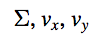
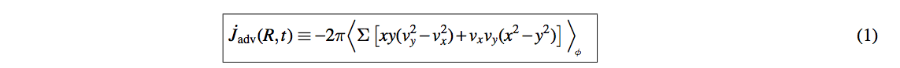
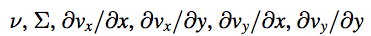
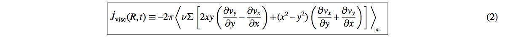
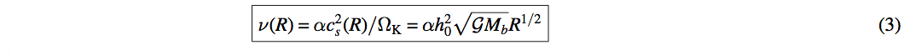
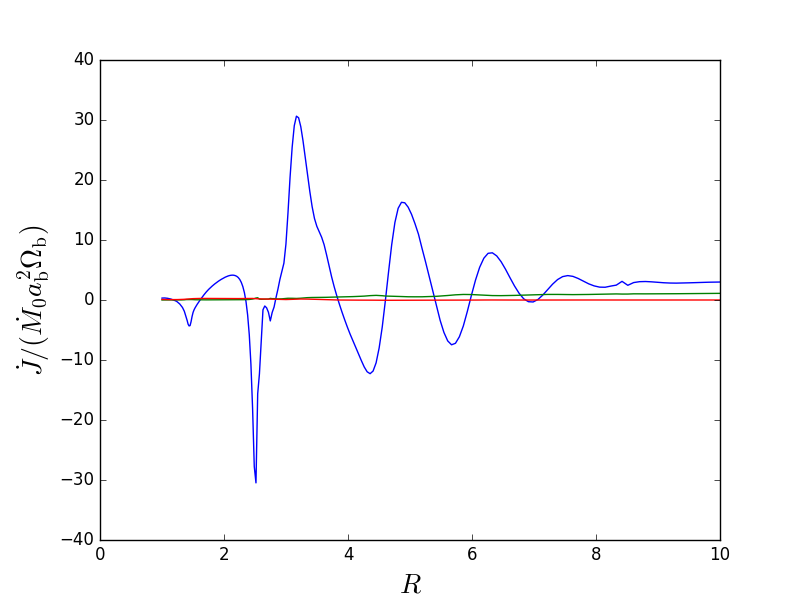

Computing angular momentum balance
======
.. sectnum::

   
Angular momentum balance for a single snapshot
-----

.. code:: python

   import numpy as np
   import matplotlib.pyplot as plt
   import disk_data_analysis.circumbinary as dda

   snap = dda.get_snapshot_data('./data/snap_',0,['POS','VELX','VELY','RHO','ACCE'])

   # if we do not have gradient data, we can compute it
   gradientvx = dda.compute_snapshot_gradient(snap,'VELX')
   gradientvy = dda.compute_snapshot_gradient(snap,'VELY')

   snap.add_data(gradientvx,'GRVX')
   snap.add_data(gradientvy,'GRVY')

As in other examples, in order to get radial profiles, it is useful to create a regularly spaced
polar grid

.. code:: python
	  
   # as in other cases, map onto a regular grid
   Rmin, Rmax = 1.0, 80.0
   NR, Nphi = 400, 600
   grid = dda.grid_polar(NR = NR, Nphi = Nphi,Rmin=1.0,Rmax= 80.0,scale='log')
   grid.X, grid.Y = grid.X + snap.header.boxsize * 0.5, grid.Y  +  snap.header.boxsize * 0.5

Onto this grid, we want to map |inlineq1| to compute the advective angular momentum transfer rate:

		      

	   
Similarly, we want to map |inlineq2| onto the grid to compute

	      
.. code:: python
	  
   #interpolating ...
   rho_interp = dda.disk_interpolate_primitive_quantities(snap,[grid.X,grid.Y],\
	                                                  quantities=['RHO'],method = 'linear')[0]

   vx_interp = dda.disk_interpolate_primitive_quantities(snap,[grid.X,grid.Y],\
	                                                 quantities=['VELX'],method = 'linear')[0]

   vy_interp = dda.disk_interpolate_primitive_quantities(snap,[grid.X,grid.Y],\
	                                                 quantities=['VELY'],method = 'linear')[0]
   

Now, let us pay specially attention on how we carry out the mapping for higher-order primitive
quantities such as the velocity gradients.

.. code:: python
	  
   #interpolating ...
   gradvx_interp = dda.disk_interpolate_gradient_quantities(snap,[grid.X,grid.Y],\
	                                                   quantities=['GRVX'],method = 'nearest')[0]

							   
   gradvy_interp = dda.disk_interpolate_gradient_quantities(snap,[grid.X,grid.Y],\
	                                                   quantities=['GRVX'],method = 'nearest')[0]

With this quantities re-mapped, we can use Equation(1) to compute the advective angular momentum
transfer rate:

.. code:: python

   gridR = grid.R.mean(axis=0)
   gridX, gridY = grid.X - snap.header.boxsize * 0.5, grid.Y  -  snap.header.boxsize * 0.5
   # compute the advective angular momentum transfer rate
   jdot_adv = -2 * np.pi * rho_interp * (gridX * gridY * (vy_interp**2 - vx_interp**2) +\
                                         vx_interp * vy_interp * (gridX**2 - gridY**2))

   # average out the azimuthal axis
   jdot_adv = jdot_adv.mean(axis=0)

To compute the viscous transfer rate, we need one more element: the kinematic viscosity coefficient
*nu* as a function of radius on the grid.

.. code:: python

   alpha = 0.1
   h0 = 0.1
   GM = 1.0
   
   def nu(R):
	  return alpha * h0**2 * np.sqrt(GM) * R**(0.5)

   nu_grid = nu(grid.R)

.. code:: python
   
   # Similarly, compute the viscous angular momentum transfer rate
   jdot_visc = (-2 * np.pi * nu_grid * rho_interp * \
	        (2 * gridX * gridY * (gradvy_interp[1] - gradvx_interp[0]) + \
		 (gridX**2 - gridY**2) * (gradvx_interp[1] + gradvy_interp[0]))).mean(axis=0)

It is useful to normalize the angular momentum flux in units of:

.. code:: python

   mdot = -2 * np.pi * (rho_interp * (gridX * vx_interp + gridY * vy_interp)).mean(axis=0)
   # if you do not know mdot0 from your simulation setup, it can be re-computed as 
   mdot0 = mdot[(grid.R.mean(axis = 0) < 62) & (grid.R.mean(axis = 0) > 50)].mean()

   jdotnorm = mdot0
   
   # and plot it
   plt.plot(grid.R.mean(axis=0),jdot_adv)
   plt.xlim(0,15)
   plt.xlabel(r'$R$')
   plt.ylabel(r'$\dot{J}_{\rm adv}$')
   plt.show()
					 

Of course, there is still one more term in the angular momentum balance equation, and that is
the external gravitational torque:

We can treat the gravitational acceleration as a gradient evaluated at the center of a cell:

.. code:: python

   snap.add_data(snap.gas.ACCE[:,0:2],'GRPHI')

   # and interpolate using the 'nearest' method
   gradphi_interp = dda.disk_interpolate_gradient_quantities(snap,[grid.X,grid.Y],\
	                                                     quantities=['GRPHI'],method = 'nearest')[0]

Then the gravitational torque density and the integrated gravitational torque are:
   
.. code:: python

   dTgravdR = -2 * np.pi * (gridR * rho_interp * (gradphi_interp[1] * gridX -\
                                                   gradphi_interp[0] * gridY)).mean(axis = 0)

   # Before integrating, make sure anomalous values are not taken into account
   Rmax = 70
   dTgravdR[gridR > Rmax] = 0.0
						   
   # now we integrate
   from scipy.integrate import cumtrapz, trapz

   Tgrav = np.asarray([trapz(dTgravdR[gridR > R],x=gridR[gridR > R]) for R in gridR[gridR <= Rmax]])

Now, we can combine the three sources of angular momentum transfer and plot them together

.. code:: python

   plt.plot(gridR[gridR <= Rmax],jdot_adv[gridR <= Rmax]/jdotnorm)
   plt.plot(gridR[gridR <= Rmax],jdot_visc[gridR <= Rmax]/jdotnorm)
   plt.plot(gridR[gridR <= Rmax],Tgrav[gridR <= Rmax]/jdotnorm)
   plt.xlim(0,10)
   plt.xlim(-0.5,3.0)
   plt.xlabel(r'$R$',size=20)
   plt.ylabel(r'$\dot{J}/(\dot{M}_0 a_{\rm b}^2\Omega_{\rm b})$',size=20)
   plt.show()
   
   

   
Angular momentum balance for a multiple snapshots
-----

The set of routines presented above are all summarized in the function
:code:`disk_compute_radial_balance`, which computes the angular momentum
transfer rate as well as the mass transfer rate as a function of radii for
a single snapshot (a single point in time).

.. code:: python

   
   mdot, jdot_adv, jdot_visc, tgrav = dda.disk_compute_radial_balance(snap,grid)

For a series of simulation snapshots, one can use this function to compute the time
evolution of the angular momentum balance and save it into a text file.

.. code:: python

   # open a file
   filename = 'jdot_balance.txt'
   f = open(filename,'w')
   
   Rmin, Rmax = 1.0, 80.0
   NR, Nphi = 400, 600
   grid = dda.grid_polar(NR = NR, Nphi = Nphi,Rmin=1.0,Rmax= 80.0,scale='log')
   grid.X, grid.Y = grid.X + snap.header.boxsize * 0.5, grid.Y  +  snap.header.boxsize * 0.5

   f.write("time\t type\t\t radii\n")
   f.write("\t\t\t\t\t"+''.join(grid.R.mean(axis = 0)+"\n") 
   
   snapmin,snapmax = 0, 100
   for snapnum in range(snapmin,snapmax):

	  snap = dda.get_snapshot_data('./data/snap_',0,['POS','VELX','VELY','RHO','ACCE'])
	  mdot, jdot_adv, jdot_visc, tgrav = dda.disk_compute_radial_balance(snap,grid)

	     
