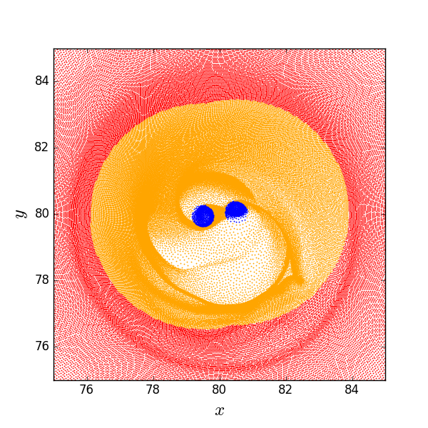

======
Computing maps of the torque distribution/density
======
.. sectnum::

   
Torque distribution map for a single snapshot
-----

First: Compute gravitational accelerations
~~~~~

Sometimes, your code output might have the gravitational
acceleration of cells already stored in. However, if you need the
back-reaction torque acting on, for example, a central binary, unless
the binary elements are a live part of the output, you might have to
recompute the accelerations due to the members of the binary
*separately*.

Accelerations
....

.. code:: python

   import numpy as np
   import matplotlib.pyplot as plt
   import disk_data_analysis.circumbinary as dda

   snap = dda.get_snapshot_data('./data/snap_',0,['POS','VELX','VELY','RHO','ACCE'])

	  
In order to compute the accelerations due to two objects orbiting each other in a Keplerian fashion, we need to compute their positions as a function of time (this only if your binary elements ARE NOT present as particles in the simulation snapshot).

.. code:: python

   from disk_data_analysis.orbital import orbit_in_time
   
   # Compute forces

   # First, 
   time = snap.header.time
   eb = 0.0
   x, y, _, _ = orbit_in_time(time + np.pi, eb)
   accel = dda.compute_external_gravforce(snap,XYZ=[0]

